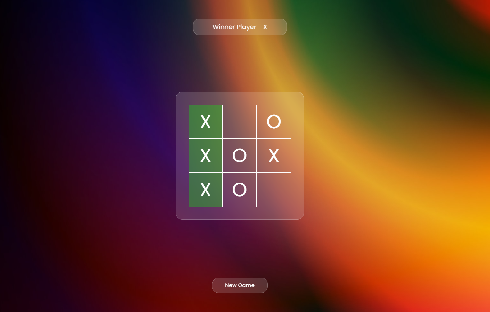

# Tic-Tac-Toe Game 🎮

A simple and interactive web-based Tic-Tac-Toe game where two players can play against each other by taking turns on a 3x3 grid. The game detects winning combinations, announces the winner, and offers a new game button to reset and play again.

## Features ✨

- **Two-Player Game**: Supports two players, "X" and "O," who take turns marking cells on the 3x3 grid.
- **Win Detection**: Automatically detects winning combinations and highlights the winning cells.
- **Tie Detection**: Declares the game as tied if all cells are filled without a winner.
- **New Game Button**: Allows players to reset the board and start a new game.

## Technologies Used 🛠️

- **HTML**: Structure of the game grid and UI.
- **CSS**: Styling for the game elements.
- **JavaScript**: Game logic, event handling, and DOM manipulation.

## Game Logic 📜

1. **Turn-Based Play**: 
   - Player "X" starts the game.
   - After each valid move, the turn switches to the other player.

2. **Winning Combinations**: 
   - The game checks for any winning combination from the predefined list of positions.
   - Winning cells are highlighted, and the winner is displayed on the screen.

3. **Game Over**: 
   - The game ends when a player wins or when all cells are filled (resulting in a tie).
   - A message is displayed, and a new game button becomes active to reset the board.